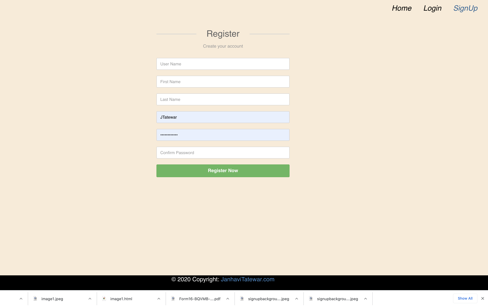
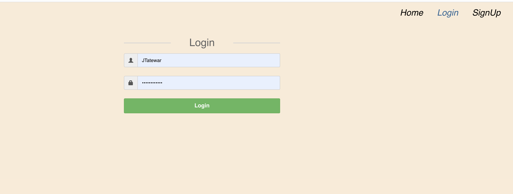
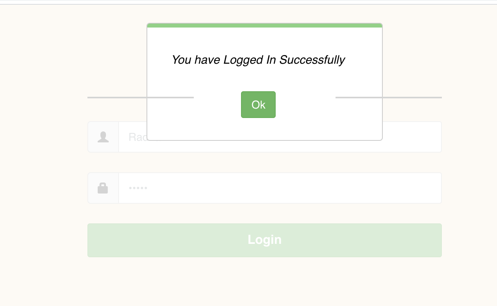
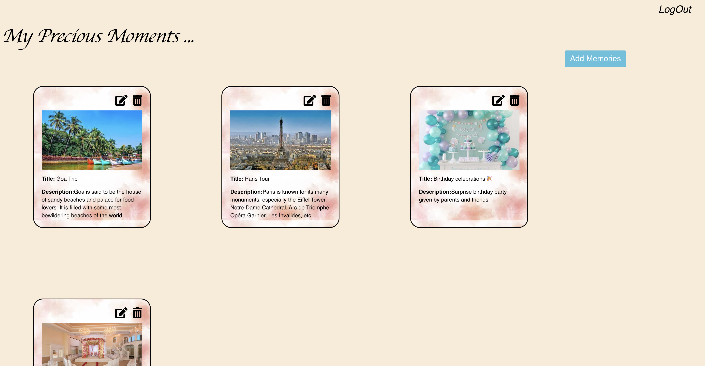
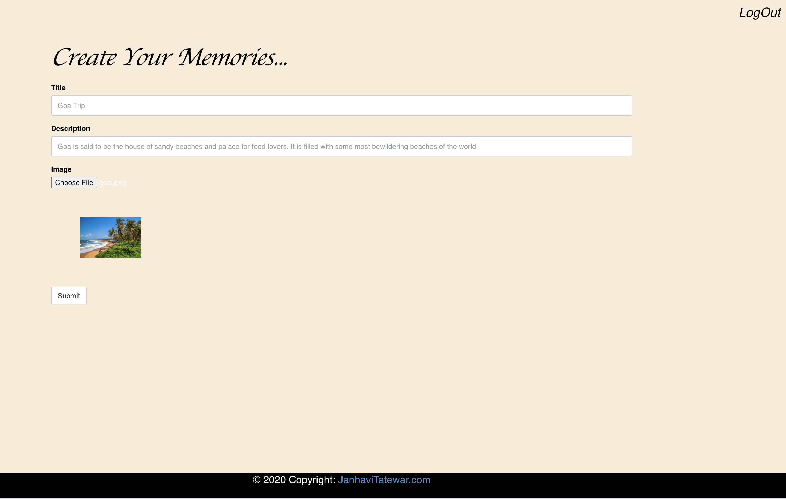
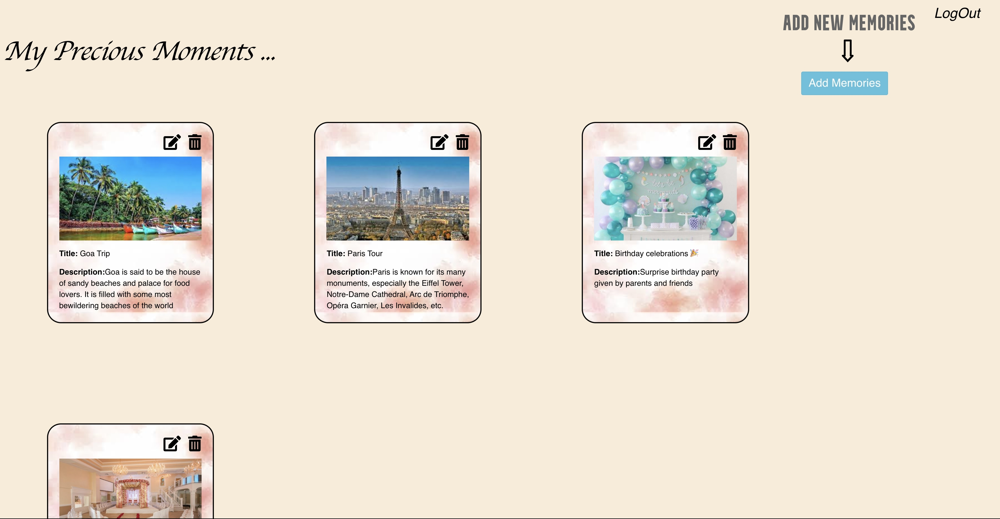
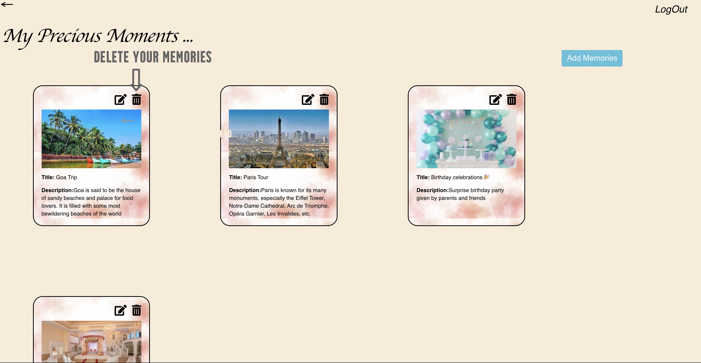

# Memories
Memories is an Application where you can create you account and store you memories
<br>
<br>
<b>
Tech Stack<br></b>
<b>Front-End </b>- React </br>
<b>Back-End</b> - Node.js, Express.js & MongoDB

Home page for memories


Sign Up Page to create your account


Login page to create your Memories


Once you logged you see this pop up


Once we log in we can see our Memories in cards .
We can create new Memories, by clicking on Add Memories button


After clicking on add Memories button we can see page line this where we can create Memories.After clicking on submit appear in all Memories list


We can add new Memory card by clicking on Add Mmemories


We can edit the Memory card by clicking on Edit icon 


We can delete the Memory card by clicking delete icon



 ### How to run this code
 ### Env Variables

Create a .env file in then root and add the following

```
MONGO_URI = your mongodb uri
``` 
Make sure MongoDB is running on your system</br>
Clone this repository</br>
Open command line in the cloned folder,</br>
To install dependencies, run npm install or yarn</br>
To run the application for development, run npm run development or yarn development</br>
Open localhost:3000 in the browser</br>


